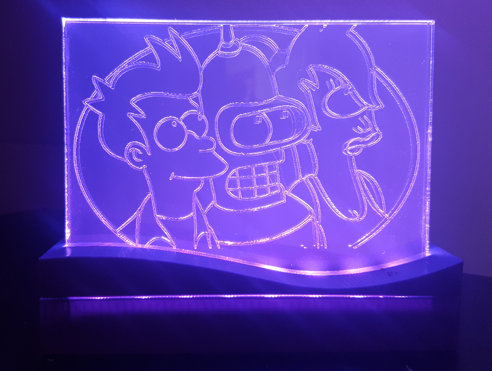
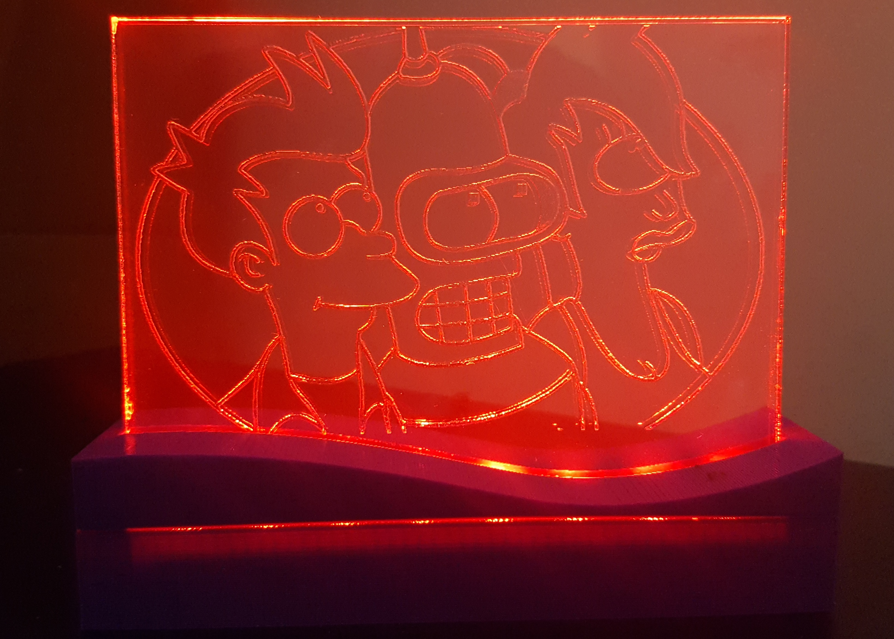

# iot-led-lamp-1

This project contains all files required for building an Internet-of-Things (iot) LED lamp. The lamp contains ws2812b LEDs connected to a [raspberry pi zero w](https://www.raspberrypi.org/products/raspberry-pi-zero-w/), which runs a REST server. The lights can be controlled from a web browser or an Android app that calls the REST API.

  

The REST API supports the following GET endpoints:
1. **/brightness-b** to change led brightness to *b*, for example: /brightness-50 sets the brightness to 50%
2. **/on** to turn on the lamp
3. **/off** to turn off the lamp
4. **/colors-r-g-b** to set lamp color with red=*r*, green=*g* and blue=*b*, for example colors-30-50-90 sets the color to *r=30%, g=50%, b=90%*
5. **/rainbow all** LED's have the same color that changes over all colors over time
6. **/random** each LED is set to a random color that changes over time

The files are organized as follows:
* **/3DPrinting** - contains all the OpenSCAD and STL files required to print the base
* **/Raspi Server Code** - contains Python files for the REST server and ws2812b LEDS on the raspberry pi zero w

